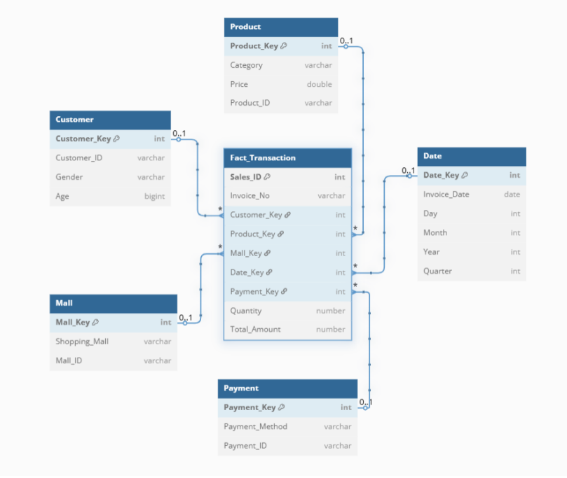

# E-commerce Data Warehouse Project

## Project Overview
This project demonstrates an end-to-end Data Warehouse solution for an e-commerce business scenario. It covers designing a star schema, performing ETL operations using Pentaho Spoon, loading data into MySQL, and executing OLAP queries to generate actionable business insights.

## Tools & Technologies
- **ETL Tool:** Pentaho Spoon
- **Database:** MySQL Workbench
- **Data Modeling:** Star Schema
- **Languages:** SQL

## Project Structure

- **`/datasets/`** — Contains sample CSV files with dummy sales data.
- **`/ktr file/`** — Contains Pentaho Spoon ETL transformation files (.ktr).
- **`/olap queries/`** — Contains SQL files demonstrating Slice, Dice, Roll-Up, and Drill-Down operations.
- **`/star schema output/`** — Excel output showing populated fact and dimension tables after ETL.
- **`schema_diagram.png`** — Screenshot of the star schema model.

## Star Schema Design

**Fact Table:**  
- `fact_sales` — Stores transactional sales data.

**Dimension Tables:**  
- `customer_dim`
- `product_dim`
- `payment_dim`
- `mall_dim`
- `date_dim`

## ETL Process

- **Extract:** Raw sales data from source CSVs.
- **Transform:** Data cleaning and mapping using Pentaho Spoon (.ktr files).
- **Load:** Populated fact and dimension tables in MySQL.
- Verified output with `star schema output` (Excel snapshot).

## OLAP Operations

- **Slice & Dice:** Filter and segment sales by product, customer, or region.
- **Roll-Up & Drill-Down:** Analyze sales trends by time (year, quarter, month) and other hierarchies.
- Example queries are included in `/olap queries/`.

## How to Use

1. Clone this repository.
2. Create the star schema tables in MySQL using `create_star_schema.sql` (if provided).
3. Run ETL transformations using Pentaho Spoon (`.ktr` files in `/ktr file/`).
4. Load sample datasets (`/datasets/`) to test the pipeline.
5. Verify the output using the Excel file in `/star schema output/`.
6. Execute OLAP queries (`/olap queries/`) to explore multi-dimensional insights.

## Author

**Pragathi Chidambaram**  
Bachelor of Technology (CSE & Business Systems)  
Knowledge Institute of Technology, Tamil Nadu  
Semester Abroad — INTI International University, Malaysia (Jan–May 2025)  

🔗 [LinkedIn](www.linkedin.com/in/pragathi-c-)  
🔗 [GitHub](https://github.com/Pragathi-25)

---

